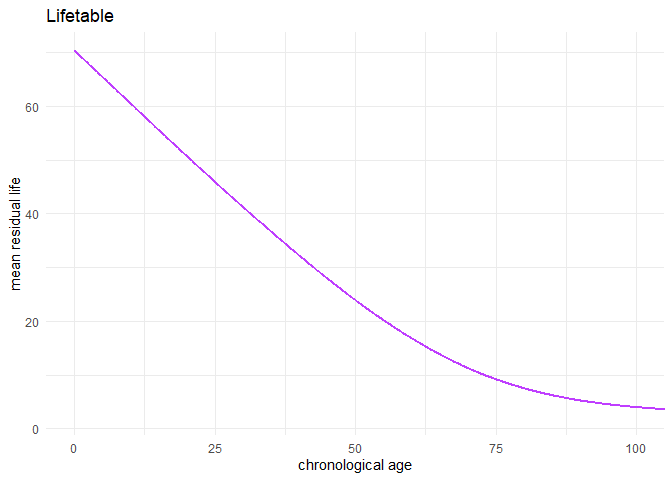
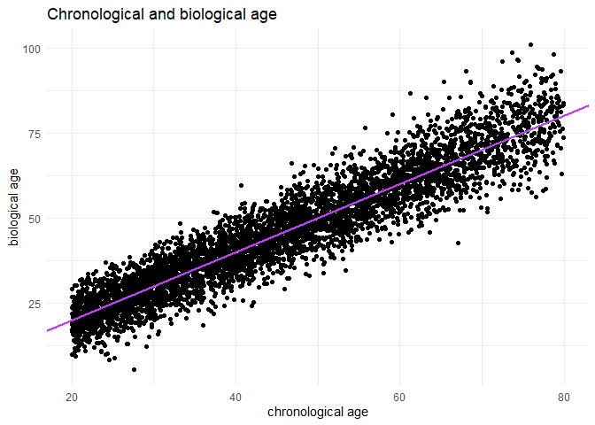
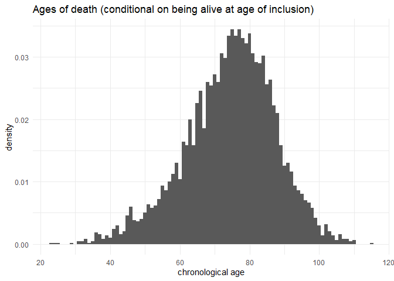
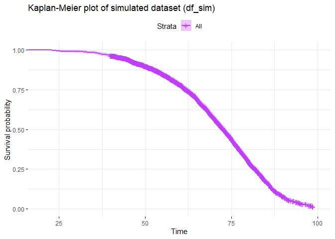
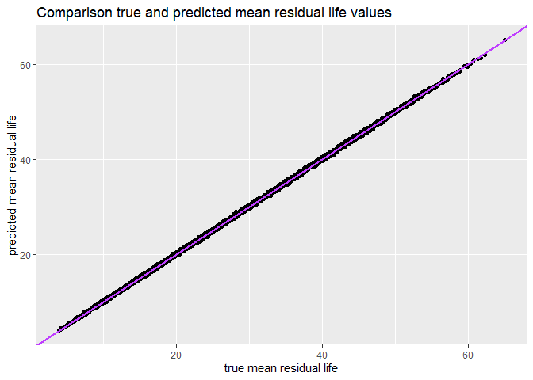
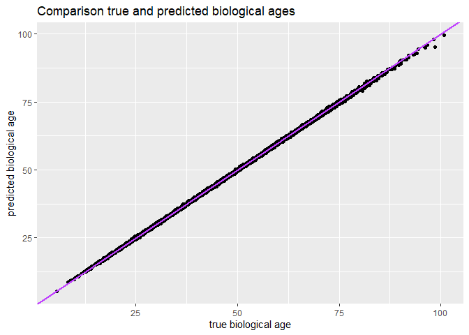

How to fit the AccelerAge framework in R: an illustration
================
Marije Sluiskes

This document contains a step-by-step tutorial on how to fit the
AccelerAge framework. It has two sections: in the first section I
simulate a synthetic lifetable and dataset, in the second section I
provide a step-by-step illustration of the AccelerAge framework. Those
primarily interested in the AccelerAge model fitting procedure can skip
the first section and move immediately to the second one.

# Simulate the data needed for the illustration

I simulate the data according to the procedure described in the paper,
assuming an Accelerated Failure Time (AFT) model with a Gompertz
baseline.

The technicalities of the data generation procedure are described in the
paper. In this illustration I use mean residual life
")
as the measure of remaining lifetime. Given that the subject has
survived until time
,
and conditional on their marker values
,
mean residual life is defined as:
![m(t\|X) = E\[T - t\| T &gt; t, X\] = \\int\_t^{\\infty} \\frac{S(u\|X)}{S(t\|X)}du](https://latex.codecogs.com/png.image?%5Cdpi%7B110%7D&space;%5Cbg_white&space;m%28t%7CX%29%20%3D%20E%5BT%20-%20t%7C%20T%20%3E%20t%2C%20X%5D%20%3D%20%5Cint_t%5E%7B%5Cinfty%7D%20%5Cfrac%7BS%28u%7CX%29%7D%7BS%28t%7CX%29%7Ddu "m(t|X) = E[T - t| T > t, X] = \int_t^{\infty} \frac{S(u|X)}{S(t|X)}du").

Under the AFT assumption,
")
is given by
![S\_0\[t \\times \\exp(\\beta^TX)\]](https://latex.codecogs.com/png.image?%5Cdpi%7B110%7D&space;%5Cbg_white&space;S_0%5Bt%20%5Ctimes%20%5Cexp%28%5Cbeta%5ETX%29%5D "S_0[t \times \exp(\beta^TX)]").The
factor
")
can hence directly be interpreted as an individual aging rate: if it is
greater than 1, a subject experiences accelerated aging. If it is
smaller than 1, decelerated aging.

``` r
################################################################
#### Parameters
################################################################

a <- exp(-9)
b <- 0.085
sigma <- 1/b # canonical parametrization
tau <- a/b # canonical parametrization

followup = 20
M <- 2 # number of predictors (all standard normally distributed)
betas <- c(0.05, 0.05) # vector of beta's (should be of length M)

N_pop <- 1e5 # population size (from which lifetable is determined)
n_obs <- 5e3 # number of observations 

################################################################
#### Create lifetable for population
################################################################

X <- matrix( rnorm(N_pop*M,mean=0,sd=1), N_pop, M) # matrix of predictors 

t <- vector(length = N_pop)                                                     
for (i in 1:N_pop){
  t[i] <- rgompertz_aft(1, sigma = sigma, tau = tau, linpred = sum(betas * X[i,])) # vector of ages-of-death
}

lifetable_pop <- as.data.frame(cbind(X, t))
lifetable_pop <- lifetable_pop[order(lifetable_pop$t),]

mrl <- vector(length = N_pop)
for (j in 1:N_pop){
  mrl[j] <- mean(lifetable_pop$t[j:N_pop]) - lifetable_pop$t[j]
}

lifetable_pop$mrl <- mrl

# smoothen 
fitsmooth <- scam(mrl ~ s(t, bs = "mpd"), data = lifetable_pop)
xx <- seq(0,max(lifetable_pop$t), by = 0.1)
lt <- as.data.frame(cbind(t = xx, mrl =  predict(fitsmooth, data.frame(t=xx))))

################################################################
#### Create data set 
################################################################

n_gen <- 2 * n_obs # twice as many to ensure I generate enough, because for some T < C => not observed

X <- as.data.frame(matrix( rnorm(n_gen*M,mean=0,sd=1), n_gen, M))
colnames(X) <- c("x1", "x2")
age_start <- runif(n_gen, 20, 80)
linpred <- rowSums(sweep(X, 2, betas, "*"))

# Get age of death
age_death <- vector(length = n_gen)
for (i in 1:n_gen){
  age_death[i] <- rgompertz_aft(1, sigma = sigma, linpred = linpred[i], tau = tau)
}

# Remove observations that are left-truncated
indx_obs <- which(age_start < age_death)[1:n_obs]  # [1:n_obs[k]] to obtain the intended sample size 
df_sim <- as.data.frame(cbind(X, age_death, age_start, linpred))[indx_obs,]

# Get mean residual life
for (i in 1:nrow(df_sim)){
  mrl_uncon <- integrate(gomp_baseline_surv, lower = (df_sim$age_start[i] * exp(df_sim$linpred[i])), 
                         upper=Inf, a = a, b = b)$value
  s_cond <-  gomp_baseline_surv(df_sim$age_start[i] * exp(df_sim$linpred[i]), a = a, b = b) 
  df_sim$mrl[i] <- (mrl_uncon / s_cond) * exp(-df_sim$linpred[i])
}

# Get biological age (via population lifetable)
for (i in 1:nrow(df_sim)){
  df_sim$b_age[i] <- lt$t[ which.min(abs(lt$mrl - df_sim$mrl[i])) ]
}

# Add censoring 
df_sim$yrs_rem <- df_sim$age_death - df_sim$age_start
wh <- which(df_sim$yrs_rem > followup) # censored
df_sim$status <- 1
df_sim$status[wh] <- 0
df_sim$follow_up_time <- df_sim$yrs_rem
df_sim$follow_up_time[wh] <- followup
df_sim$age_end <- df_sim$age_start + df_sim$follow_up_time
```

## Plots of the simulated data

<!-- --><!-- --><!-- --><!-- -->

# Fitting the AccelerAge framework

In this section the AccelerAge framework is fitted on the data simulated
above. To fit the AccelerAge-framework, you need:

-   A dataset `df_sim` with for each subject: markers of interest (here:
    `x1` and `x2`), chronological age at entry (here: `age_start`) and
    the chronological age at which the subject dies or is censored
    (here: `age_end`).
-   A lifetable of your population of interest (here: `lt`). This
    lifetable should contain the mean residual life value within the
    population for different values of chronological age. (If you are
    interested in some other function of residual life, e.g. median
    residual life, it should contain these values.)

If you are fitting a parametric AFT model, as I am in this illustration,
you will also need to make an assumption about the underlying
distribution of the event times. In this case I will fit an AFT Gompertz
model, which is in correspondence with the true data-generating
mechanism.

For simplicity I do not use a test data set, but if you have enough data
available (or, even better, an external validation data set) it would be
advisable to fit your model on a different data set than the one you are
evaluating it on.

### 1. Fit the AFT model and obtain the parameter estimates

I use the `aftreg` function from the [`eha`
package](https://cran.r-project.org/web/packages/eha/eha.pdf). This
function can fit an AFT Gompertz model and is able to deal with delayed
entry data (left-truncated data).

``` r
fit_aft <- eha::aftreg(formula = Surv(age_start, age_end, status) ~ x1 + x2, 
                          data = df_sim, dist = "gompertz") 

# get estimated parameters
sigma_est <- exp(fit_aft$coefficients["log(scale)"]) # canonical parametrization
tau_est <- exp(fit_aft$coefficients["log(shape)"]) # canonical parametrization
a_est <- tau_est / sigma_est
b_est <- 1 / sigma_est
```

If instead of an AFT Gompertz model, you want to fit a parametric AFT
model with a different distribution, you can change the `dist` parameter
(e.g. to `weibull`, `loglogistic` or `lognormal`).

### 2. Obtain the linear predictors

The linear predictors can be obtained by multiplying your predictor
variables, `x1` and `x2` here, with the estimated parameter
coefficients.

``` r
betas_est_aft <- fit_aft$coefficients[1:M]
linpred_aft <- rowSums(sweep(df_sim[,1:M], 2, betas_est_aft, "*"))
```

### 3. Predict mean residual life

Your regression will have resulted in estimated Gompertz parameters
(
and
,
or in the [canonical
parametrization](https://cran.r-project.org/web/packages/eha/vignettes/gompertz.html),

and
).
By integrating over the Gompertz survival curve defined by these
parameters, taking into account the linear predictors, it is possible to
obtain a predicted mean residual life value.

``` r
for (i in 1:nrow(df_sim)){
  mrl_uncon <- integrate(gomp_baseline_surv, lower = (df_sim$age_start[i] * exp(linpred_aft[i])), 
                         upper=Inf, a = a_est, b = b_est)$value
  s_cond <-  gomp_baseline_surv(df_sim$age_start[i] * exp(linpred_aft[i]), a = a_est, b = b_est) 
  df_sim$pred_mrl[i] <- (mrl_uncon / s_cond) * exp(-linpred_aft[i])
}
```

In this simulated scenario, I know the true mean residual life values.
So I can compare my predicted values with the true values. This would of
course not be possible in a real data setting.

<!-- -->

They agree very closely, which is in line with what I want to see: after
all, my dataset `df_sim` was simulated under an AFT Gompertz scenario.

### 4. Obtain the biological age predictions

In this final step the lifetable is needed to move from mean residual
life to biological age. Given a mean residual life prediction, I select
the chronological age in the lifetable whose corresponding mean residual
life value is closest to the prediction.

``` r
for (i in 1:length(df_sim$pred_mrl)){
  df_sim$pred_b_age[i] <- lt$t[which.min(abs(lt$mrl - df_sim$pred_mrl[i]))]
}
```

Once again, since I know the underlying true biological age in this
simulated scenario, I can check whether my predicted biological age
values correspond with the true ones. When using real data this is not
an option. In that case you can look at measures such as calibration or
discrimination, as elaborated upon in the paper.

``` r
df_sim %>% 
  ggplot(aes(x = b_age, y = pred_b_age)) +
  geom_point() +
  geom_abline(intercept = 0, slope = 1, col = mycol, size = 1) +
  labs(title = "Comparison true and predicted biological ages",
       x = "true biological age", y = "predicted biological age")
```

<!-- -->
